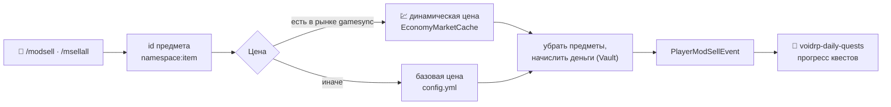

<p align="center"></p>

<div align="center">


[](https://github.com/VOIDRP-MINECRAFT/voidrp-mod-sell/actions/workflows/build.yml)


</div>

> Paper-плагин VoidRP: продажа предметов из модов прямо из инвентаря по рыночной цене — для того, чего нет
> в магазине. Продажи засчитываются в ежедневные квесты.

---

## 🗺️ Как это работает



Цена сначала берётся из динамического рынка `voidrp-gamesync-plugin` (без жёсткой зависимости — через отражение),
а если предмета там нет — из `config.yml`. Предмет без цены продать нельзя.

---

## ⌨️ Команды

| Команда | Что делает |
|---|---|
| `/modsell [кол-во \| all]` (`/мпродать`) | Продать предмет из руки: без аргумента — стек в руке, число — столько штук, `all` — все такие предметы в инвентаре |
| `/msellall` (`/мпродатьвсё`) | Продать все подходящие предметы из инвентаря |
| `/msellinfo` (`/мценник`) | Узнать цену предмета в руке |
| `/msellreload` | Перечитать конфиг (`voidrp.modsell.admin`) |

---

## ⚙️ Конфигурация

`plugins/VoidRpModSell/config.yml` — 67 предметов из Create, Mekanism, AE2, Immersive Engineering,
Industrial Foregoing и Draconic Evolution:

```yaml
items:
  create:brass_ingot:              { price: 152,  name: "Слиток латуни" }
  mekanism:ingot_osmium:           { price: 152,  name: "Слиток осмия" }
  ae2:engineering_processor:       { price: 3000, name: "Инженерный процессор" }
```

---

## 🚀 Сборка

```bash
./gradlew build
```

Требования: Paper/Mohist 1.21.1, Java 21, Vault (обязательно), VoidRpGameSync (по желанию — динамические цены).

---

## 🔗 Связанные репозитории

| Репо | Связь |
|---|---|
| [voidrp-gamesync-plugin](https://github.com/VOIDRP-MINECRAFT/voidrp-gamesync-plugin) | Динамические цены (`EconomyMarketCache`) |
| [voidrp-daily-quests](https://github.com/VOIDRP-MINECRAFT/voidrp-daily-quests) | Слушает `PlayerModSellEvent` |

---

<div align="center">
<a href="https://void-rp.ru">🌐 Сайт</a> ·
<a href="https://github.com/VOIDRP-MINECRAFT">🏠 Организация</a>
</div>
